# ACE-open Framework: Comprehensive Architecture

## System Overview

The ACE (Adaptive Context Engine) framework implements a Generator-Evaluator-Reflector pattern with continuous learning through a structured playbook. This document provides complete architectural diagrams with detailed annotations.

---

## 1. High-Level Architecture: Three-Layer ACE Pattern

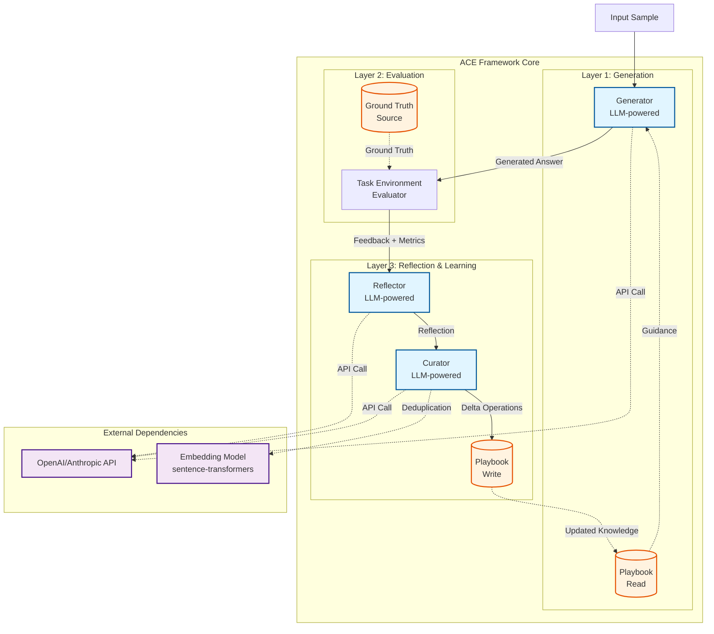

**Key Points:**
- **Generator**: Reads playbook, generates answers using LLM
- **Evaluator**: Compares output to ground truth, provides feedback
- **Reflector**: Analyzes performance, extracts lessons
- **Curator**: Transforms lessons into playbook updates
- **Playbook**: Persistent knowledge store (read by Generator, written by Curator)


---

## 2. Detailed Component Architecture with Data Flows

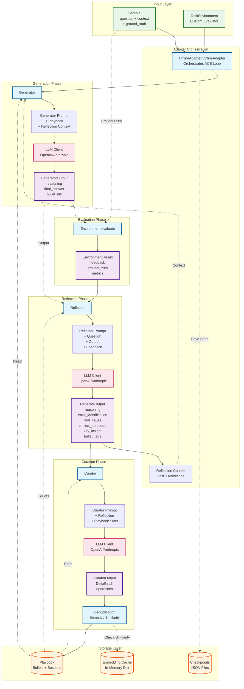

**Component Responsibilities:**

1. **Adapter**: Orchestrates the entire loop, manages state, handles checkpointing
2. **Generator**: Creates answers using playbook guidance and reflection context
3. **Evaluator**: Task-specific evaluation logic (user-provided)
4. **Reflector**: Analyzes performance and extracts structured lessons
5. **Curator**: Transforms reflections into playbook delta operations
6. **Deduplication**: Prevents redundant bullets using semantic similarity


---

## 3. LLM API Integration Points

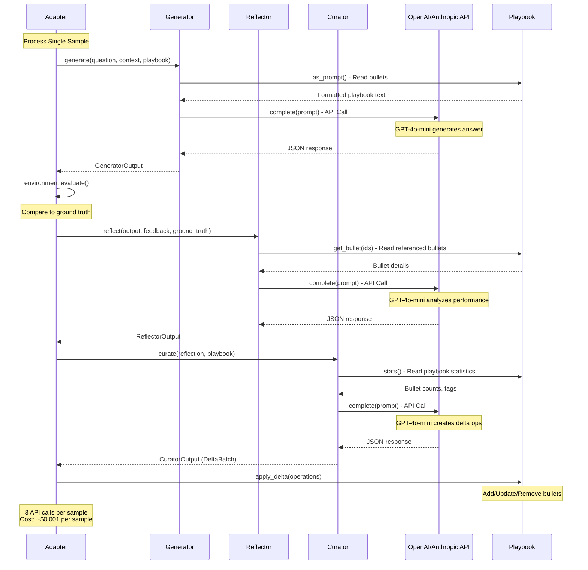

**API Call Breakdown:**
- **Call #1 (Generator)**: Generate answer based on question + playbook
- **Call #2 (Reflector)**: Analyze performance and extract lessons
- **Call #3 (Curator)**: Transform reflection into playbook operations

**Cost Analysis** (GPT-4o-mini):
- Input tokens: ~1,500 per call (playbook + prompts)
- Output tokens: ~500 per call (JSON responses)
- Total per sample: ~6,000 tokens = $0.001
- 1,000 samples: ~$1.00


---

## 4. Data Architecture & Storage

```mermaid
graph TB
    subgraph "In-Memory Storage"
        PB[Playbook Object<br/>_bullets: Dict[str, Bullet]<br/>_sections: Dict[str, List[str]]<br/>_next_id: int]
        RC[Reflection Context<br/>List[str] - Last 3 reflections]
        ECACHE[Embedding Cache<br/>Dict[str, np.ndarray]<br/>Global cache for deduplication]
    end
    
    subgraph "Persistent Storage - File System"
        CKPT[Checkpoint Files<br/>checkpoint_epoch1_step1.json<br/>checkpoint_epoch1_step2.json<br/>...]
        LOGS[Log Files<br/>qa_experiment_*.log<br/>json_failures.log]
        RESULTS[Results Files<br/>experiment_results.json]
    end
    
    subgraph "External Storage - Not Implemented"
        VDB[(Vector Database<br/>OPTIONAL<br/>Pinecone/Weaviate/Chroma)]
        CACHE_DB[(Redis/Memcached<br/>OPTIONAL<br/>Distributed cache)]
    end
    
    subgraph "Data Structures"
        BULLET[Bullet<br/>id: str<br/>section: str<br/>content: str<br/>helpful: int<br/>harmful: int<br/>neutral: int<br/>created_at: str<br/>updated_at: str]
        
        SAMPLE[Sample<br/>question: str<br/>context: str<br/>ground_truth: Optional[str]<br/>metadata: Dict]
        
        ENVRES[EnvironmentResult<br/>feedback: str<br/>ground_truth: Optional[str]<br/>metrics: Dict[str, float]]
    end
    
    %% Relationships
    PB -->|Contains| BULLET
    PB -.Serialized to.-> CKPT
    CKPT -.Restored to.-> PB
    
    SAMPLE -.Provides.-> ENVRES
    
    ECACHE -.Used by.-> PB
    
    PB -.Could use.-> VDB
    ECACHE -.Could use.-> CACHE_DB
    
    %% Styling
    classDef memory fill:#e1f5ff,stroke:#01579b,stroke-width:2px
    classDef disk fill:#fff3e0,stroke:#e65100,stroke-width:2px
    classDef optional fill:#f5f5f5,stroke:#9e9e9e,stroke-width:2px,stroke-dasharray: 5 5
    classDef struct fill:#e8f5e9,stroke:#2e7d32,stroke-width:2px
    
    class PB,RC,ECACHE memory
    class CKPT,LOGS,RESULTS disk
    class VDB,CACHE_DB optional
    class BULLET,SAMPLE,ENVRES struct
```

**Storage Details:**

### In-Memory Storage
- **Playbook**: Primary knowledge store, held in RAM during execution
- **Reflection Context**: Sliding window of last 3 reflections for context
- **Embedding Cache**: Global dictionary caching sentence embeddings for deduplication

### Persistent Storage (File System)
- **Checkpoints**: JSON snapshots of playbook state after each sample
  - Format: `checkpoint_epoch{N}_step{M}.json`
  - Contains: playbook dict, epoch, step, timestamp, recent reflections
  - Used for: Resume from failure, analysis, debugging

- **Logs**: Structured logging output
  - `qa_experiment_*.log`: Experiment execution logs
  - `json_failures.log`: Failed JSON parsing attempts for debugging

- **Results**: Final experiment outputs
  - `experiment_results.json`: Complete results with config, metrics, playbook

### External Storage (Optional - Not Currently Implemented)
- **Vector Database**: Could store bullet embeddings for semantic search
- **Distributed Cache**: Could share embeddings across multiple processes


---

## 5. Ground Truth Handling - CRITICAL CLARIFICATION

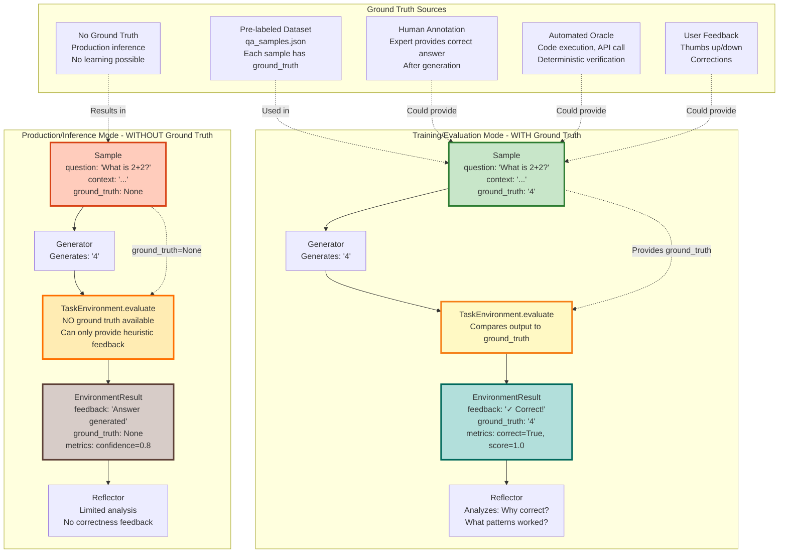

### Ground Truth Modes Explained

#### Mode 1: Training/Evaluation (WITH Ground Truth)
**When**: Offline training, benchmarking, testing
**Ground Truth Source**: 
- Pre-labeled datasets (e.g., `qa_samples.json`)
- Human annotations
- Automated oracles (code execution, API verification)
- Historical data with known correct answers

**Behavior**:
- Evaluator compares generated output to ground truth
- Provides accurate feedback ("✓ Correct" or "✗ Incorrect")
- Reflector can analyze WHY answer was right/wrong
- Playbook learns from mistakes
- Metrics are meaningful (accuracy, exact match, etc.)

**Example**:
```python
sample = Sample(
    question="What is the capital of France?",
    context="France is a country in Western Europe...",
    ground_truth="Paris"  # ← Ground truth provided
)
# Evaluator can verify: output == "Paris" → Correct!
```


#### Mode 2: Production/Inference (WITHOUT Ground Truth)
**When**: Real-world deployment, user-facing applications
**Ground Truth Source**: None (or delayed/partial feedback)

**Behavior**:
- Evaluator CANNOT verify correctness
- Can only provide heuristic feedback:
  - "Answer generated successfully"
  - Confidence scores (if available)
  - Format validation
  - Consistency checks
- Reflector has limited learning capability
- Playbook growth is minimal or disabled
- Metrics are heuristic (confidence, not accuracy)

**Example**:
```python
sample = Sample(
    question="What will the stock market do tomorrow?",
    context="Current market conditions...",
    ground_truth=None  # ← No ground truth available
)
# Evaluator cannot verify correctness
# Can only check: "Answer is well-formed"
```

**Production Strategies**:
1. **No Learning**: Disable adaptation, use pre-trained playbook
2. **Delayed Learning**: Collect user feedback, retrain offline later
3. **Heuristic Learning**: Learn from proxy signals (user engagement, consistency)
4. **Human-in-Loop**: Route uncertain cases to human review

#### Mode 3: Hybrid (Partial Ground Truth)
**When**: Production with feedback mechanisms
**Ground Truth Source**: User feedback, delayed verification

**Behavior**:
- Initial inference without ground truth
- User provides feedback (thumbs up/down, corrections)
- Feedback becomes "ground truth" for learning
- Playbook updates based on user corrections

**Example**:
```python
# Step 1: Generate without ground truth
sample = Sample(question="...", ground_truth=None)
output = generator.generate(sample)

# Step 2: User provides feedback
user_feedback = "Incorrect, should be X"

# Step 3: Create learning sample
learning_sample = Sample(
    question=sample.question,
    ground_truth="X"  # ← User-provided ground truth
)
# Now can learn from this feedback
```

### Key Insight: Ground Truth is ONLY for Training

**IMPORTANT**: Ground truth is NOT required for the Generator to work. It's ONLY needed for:
1. **Evaluation**: Measuring performance
2. **Reflection**: Learning from mistakes
3. **Playbook Growth**: Improving over time

**In production**:
- Generator works fine without ground truth
- Evaluator provides generic feedback
- Reflection/learning is disabled or limited
- Use pre-trained playbook from offline training


---

## 6. Embedding Generation & Deduplication Flow

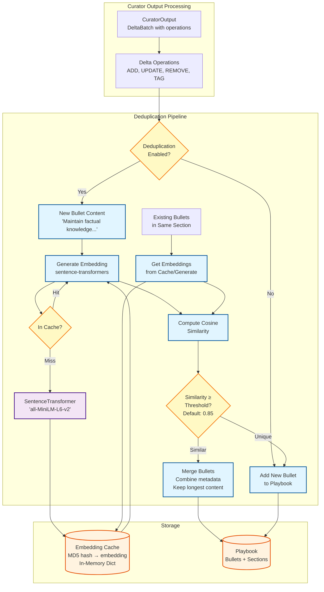

**Deduplication Process:**

1. **Trigger**: When Curator creates ADD operation for new bullet
2. **Embedding Generation**: 
   - Compute sentence embedding for new bullet content
   - Use lightweight model: `all-MiniLM-L6-v2` (384 dimensions)
   - Cache embeddings using MD5 hash as key
3. **Similarity Check**:
   - Compare new bullet to all existing bullets in same section
   - Use cosine similarity on embeddings
   - Threshold: 0.85 (85% similar = duplicate)
4. **Merge or Add**:
   - If similar bullet found: Merge (keep longest content, sum metadata)
   - If unique: Add as new bullet

**Performance Optimization:**
- **Caching**: Embeddings cached in memory (global dict)
- **Batch Processing**: Can process multiple bullets at once
- **Section Filtering**: Only compare within same section
- **Lazy Loading**: Model loaded on first use

**Example**:
```python
# Bullet 1: "Maintain factual knowledge for accuracy"
# Bullet 2: "Maintaining factual knowledge is crucial"
# Similarity: 0.92 → MERGE

# Bullet 3: "Precision in terminology is important"
# Similarity to 1: 0.45 → ADD as new bullet
```


---

## 7. Complete Adaptation Loop - Single Sample

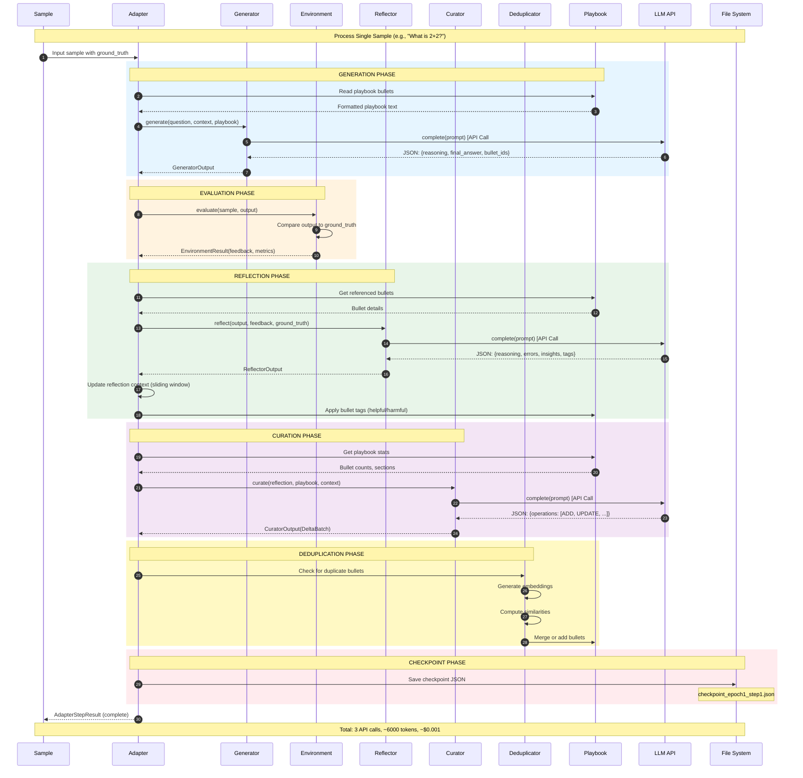

**Step-by-Step Breakdown:**

1. **Input**: Sample with question, context, and ground_truth
2. **Read Playbook**: Get current knowledge base
3. **Generate**: LLM creates answer using playbook guidance (API Call #1)
4. **Evaluate**: Compare output to ground truth, calculate metrics
5. **Reflect**: LLM analyzes performance and extracts lessons (API Call #2)
6. **Update Context**: Add reflection to sliding window (last 3)
7. **Tag Bullets**: Mark referenced bullets as helpful/harmful
8. **Get Stats**: Retrieve playbook statistics
9. **Curate**: LLM transforms reflection into operations (API Call #3)
10. **Deduplicate**: Check for similar bullets, merge if needed
11. **Update Playbook**: Apply delta operations (add/update/remove)
12. **Checkpoint**: Save state to disk
13. **Return**: Complete result with all outputs

**Timing** (approximate):
- Generation: 2-3 seconds
- Evaluation: <0.1 seconds
- Reflection: 2-3 seconds
- Curation: 2-3 seconds
- Deduplication: 0.5-1 seconds
- **Total**: ~8-10 seconds per sample


---

## 8. Multi-Epoch Training Architecture

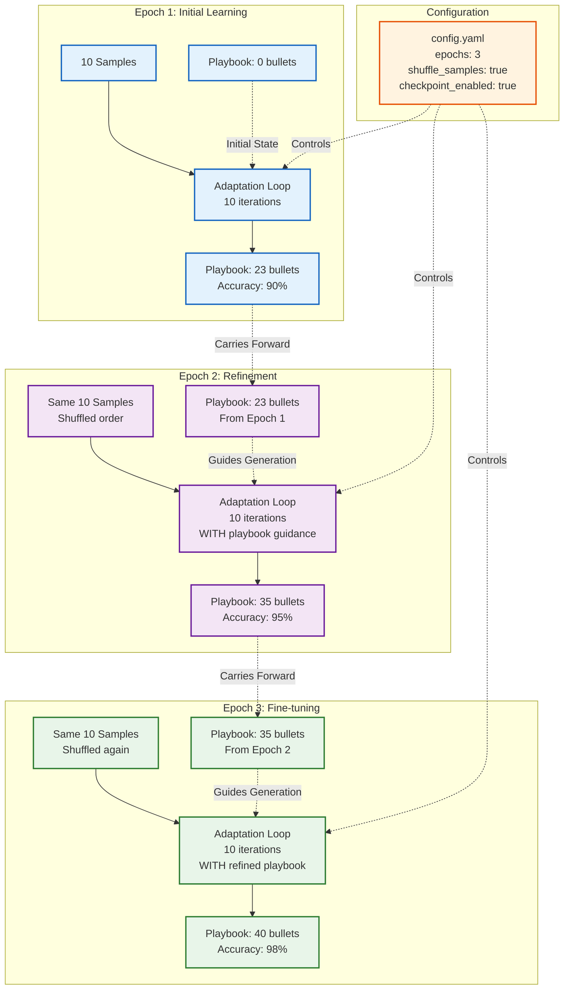

**Multi-Epoch Training Explained:**

### Epoch 1: Initial Learning (Baseline)
- **Playbook State**: Empty (0 bullets)
- **Generator Behavior**: Uses only base LLM knowledge
- **Learning**: Discovers fundamental patterns
- **Result**: 23 bullets, 90% accuracy
- **Bullets Created**: Basic patterns like "maintain factual knowledge"

### Epoch 2: Guided Improvement
- **Playbook State**: 23 bullets from Epoch 1
- **Generator Behavior**: Reads playbook before answering
- **Learning**: Refines existing patterns, adds edge cases
- **Result**: 35 bullets (+12), 95% accuracy (+5%)
- **Improvement**: Fixes photosynthesis error using "precision in terminology" bullet

### Epoch 3: Fine-tuning
- **Playbook State**: 35 bullets from Epoch 2
- **Generator Behavior**: Uses refined playbook
- **Learning**: Minimal new patterns, mostly reinforcement
- **Result**: 40 bullets (+5), 98% accuracy (+3%)
- **Improvement**: Handles rare cases, optimizes phrasing

**Key Mechanisms:**

1. **Sample Shuffling**: Prevents order-dependent learning
2. **Playbook Persistence**: Knowledge carries forward between epochs
3. **Checkpointing**: State saved after each sample for recovery
4. **Deduplication**: Prevents redundant bullets across epochs

**Configuration**:
```yaml
adaptation:
  mode: "offline"
  epochs: 3
  shuffle_samples: true
  checkpoint_enabled: true
  checkpoint_frequency: 1  # Save after each sample
```


---

## 9. Architectural Patterns & Design Decisions

### Pattern 1: Feedback Loop Architecture

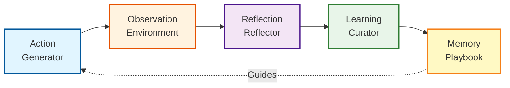

**Pattern**: Observe-Orient-Decide-Act (OODA) Loop
- **Observe**: Environment evaluates output
- **Orient**: Reflector analyzes performance
- **Decide**: Curator determines updates
- **Act**: Generator uses updated playbook

### Pattern 2: Pipeline Architecture

```
Input → Generator → Evaluator → Reflector → Curator → Output
         ↑                                              ↓
         └──────────────── Playbook ←───────────────────┘
```

**Characteristics**:
- Sequential processing
- Each stage has single responsibility
- Playbook provides feedback loop
- Stateful (playbook persists across samples)

### Pattern 3: Agent Architecture

```
Agent = Generator + Playbook (Memory)
Environment = Evaluator
Trainer = Reflector + Curator
```

**Characteristics**:
- Agent learns from environment feedback
- Memory (playbook) improves agent over time
- Trainer extracts and stores lessons

---

## Key Design Decisions

### Decision 1: Synchronous vs Asynchronous

**Current**: **Synchronous** (blocking)
- Each sample processed sequentially
- Wait for LLM responses before continuing
- Simple, predictable, easy to debug

**Alternative**: Asynchronous (non-blocking)
- Process multiple samples in parallel
- Batch LLM API calls
- Complex state management

**Rationale**: Synchronous chosen for MVP simplicity. Async can be added later for scale.


### Decision 2: Stateful vs Stateless Components

**Stateful Components**:
- **Playbook**: Accumulates knowledge across samples
- **Adapter**: Maintains reflection context (last 3)
- **Embedding Cache**: Stores computed embeddings

**Stateless Components**:
- **Generator**: No state between calls
- **Reflector**: No state between calls
- **Curator**: No state between calls
- **Evaluator**: No state between calls

**Rationale**: 
- Roles (Generator/Reflector/Curator) are stateless for testability
- Adapter manages all state for clear separation of concerns
- Playbook is the only persistent knowledge store

### Decision 3: In-Memory vs Persistent Storage

**In-Memory**:
- Playbook (during execution)
- Reflection context
- Embedding cache

**Persistent**:
- Checkpoints (JSON files)
- Logs (text files)
- Results (JSON files)

**Rationale**:
- In-memory for performance during execution
- Persistent for recovery, analysis, and reproducibility
- No database required for MVP (file system sufficient)

### Decision 4: Centralized vs Distributed

**Current**: **Centralized** (single process)
- All components in one Python process
- Shared memory for playbook and cache
- File system for persistence

**Alternative**: Distributed (multiple processes/machines)
- Vector database for playbook (Pinecone, Weaviate)
- Redis for embedding cache
- Message queue for coordination

**Rationale**: Centralized sufficient for MVP scale (1000s of samples). Distributed can be added for production scale (millions of samples).

### Decision 5: LLM Provider Abstraction

**Design**: Abstract `LLMClient` interface
- Supports OpenAI, Anthropic, Transformers
- Easy to add new providers
- Consistent API across providers

**Benefits**:
- Provider-agnostic framework
- Easy testing with `DummyLLMClient`
- Cost optimization (switch providers)

**Implementation**:
```python
class LLMClient(ABC):
    @abstractmethod
    def complete(self, prompt: str) -> LLMResponse:
        pass
```


### Decision 6: Error Handling Strategy

**Approach**: Fail-fast with fallback option

**Configuration**:
```yaml
adaptation:
  fail_fast: true  # Raise exception on error
  # OR
  fail_fast: false  # Continue with fallback result
```

**Fail-Fast Mode** (default):
- Exception raised on any error
- Execution stops immediately
- Best for development and debugging

**Fallback Mode**:
- Errors logged but execution continues
- Fallback result created with error details
- Best for production resilience

**Error Types Handled**:
- LLM API failures (timeout, rate limit)
- JSON parsing errors (malformed output)
- Evaluation errors (missing ground truth)
- Deduplication errors (embedding failures)

### Decision 7: Scalability Considerations

**Current Scale** (MVP):
- 10-1,000 samples per experiment
- Single machine, single process
- File system storage
- In-memory playbook

**Future Scale** (Production):
- 100,000+ samples per experiment
- Distributed processing
- Vector database for playbook
- Distributed cache for embeddings

**Scaling Path**:
1. **Vertical**: Increase machine resources (RAM, CPU)
2. **Horizontal**: Distribute across multiple machines
3. **Optimization**: Batch API calls, cache aggressively
4. **Infrastructure**: Add vector DB, message queue, distributed cache

**Bottlenecks**:
- LLM API rate limits (primary bottleneck)
- Embedding computation (secondary)
- Playbook size (grows linearly with samples)

**Mitigation**:
- Batch API calls (reduce latency)
- Aggressive deduplication (limit playbook growth)
- Caching (reduce redundant computation)
- Async processing (improve throughput)


---

## 10. Deployment Architecture Options

### Option A: Research/Development (Current MVP)

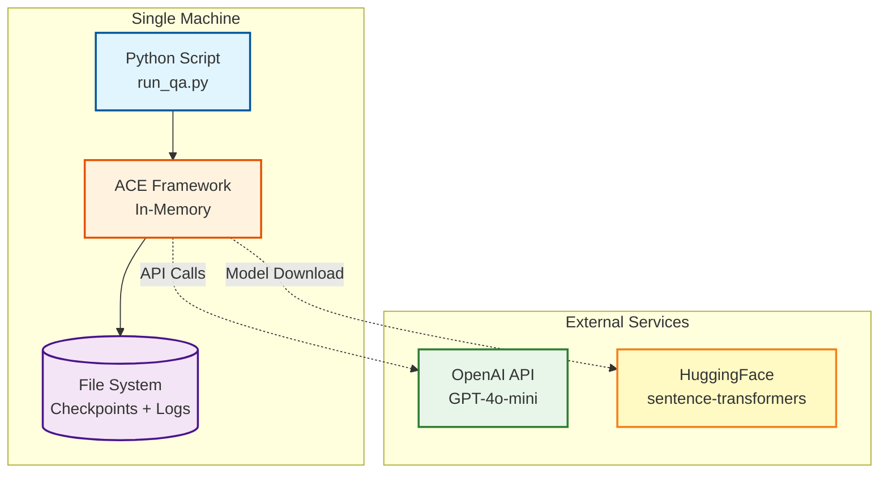

**Characteristics**:
- Single Python process
- Local file system storage
- Direct API calls to OpenAI
- No infrastructure required

**Use Cases**:
- Research experiments
- Prototyping
- Small datasets (<10,000 samples)
- Development and testing

---

### Option B: Production Inference (No Learning)

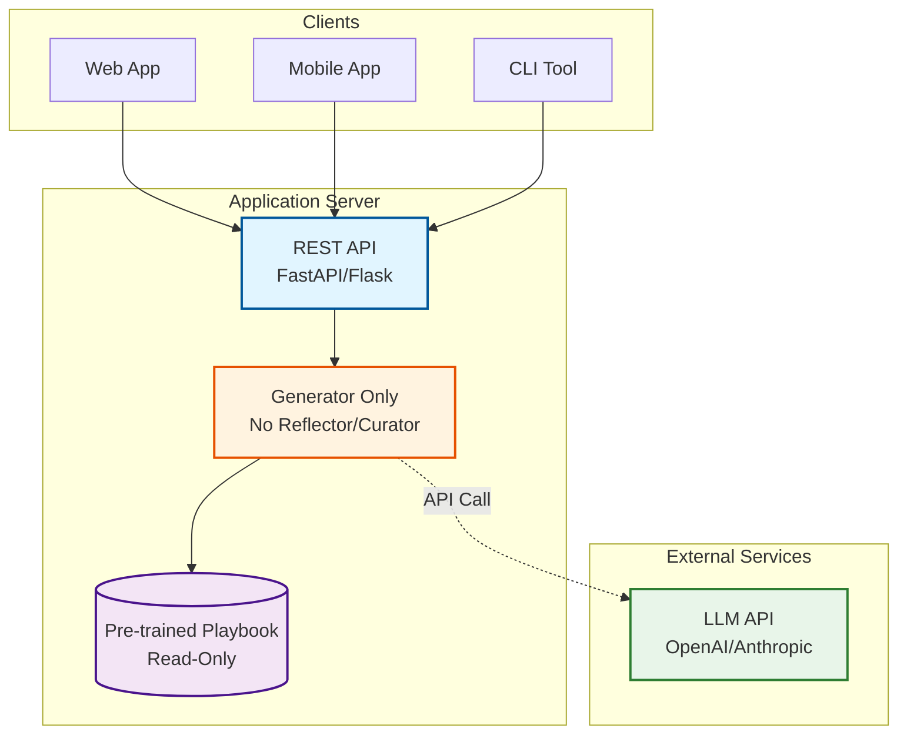

**Characteristics**:
- Generator only (no learning loop)
- Pre-trained playbook loaded at startup
- Fast inference (<3 seconds per request)
- Stateless API (horizontally scalable)

**Use Cases**:
- User-facing applications
- Real-time inference
- No ground truth available
- High throughput required


---

### Option C: Production with Continuous Learning

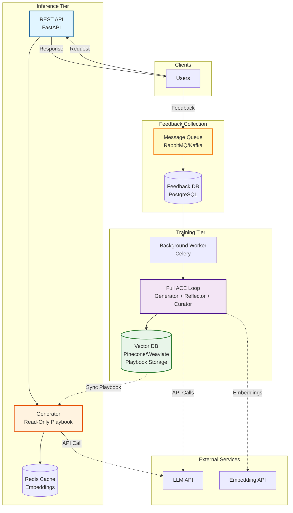

**Characteristics**:
- Separate inference and training tiers
- Inference uses read-only playbook (fast)
- User feedback collected asynchronously
- Background workers retrain periodically
- Playbook synced from vector DB

**Use Cases**:
- Production with user feedback
- Continuous improvement
- A/B testing of playbooks
- Large-scale deployment

**Workflow**:
1. User sends request → Fast inference with current playbook
2. User provides feedback → Queued for training
3. Background worker processes feedback batch
4. Full ACE loop runs with feedback as ground truth
5. Updated playbook saved to vector DB
6. Inference tier syncs new playbook (hourly/daily)

---

## 11. Security & Privacy Considerations

### Data Flow Security

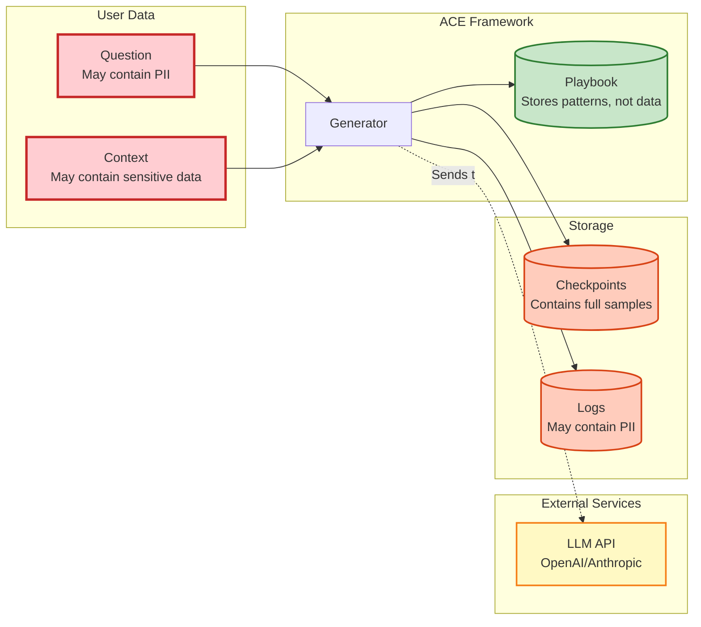

**Security Concerns**:

1. **PII in Samples**: Questions/context may contain personal information
   - **Risk**: Sent to LLM API, stored in checkpoints/logs
   - **Mitigation**: Anonymize data before processing, use private LLM deployment

2. **Checkpoint Storage**: Contains full sample data including ground truth
   - **Risk**: Sensitive data persisted to disk
   - **Mitigation**: Encrypt checkpoints, secure file permissions, delete after training

3. **Log Files**: May contain PII from samples and outputs
   - **Risk**: Unencrypted logs accessible to admins
   - **Mitigation**: Redact PII in logs, encrypt log files, rotate frequently

4. **Playbook Content**: Stores patterns, not raw data
   - **Risk**: Low (abstracts away specific data)
   - **Benefit**: Safe to share and version control

5. **API Keys**: Required for LLM access
   - **Risk**: Exposed keys allow unauthorized API usage
   - **Mitigation**: Environment variables, secret management, key rotation

**Best Practices**:
- Use environment variables for API keys (never commit to git)
- Encrypt checkpoints and logs at rest
- Anonymize PII before processing
- Use private LLM deployment for sensitive data
- Implement data retention policies (delete old checkpoints)
- Audit log access and API usage


---

## 12. Summary: Key Architectural Insights

### Core Architecture
- **Pattern**: Generator-Evaluator-Reflector with feedback loop
- **Components**: 5 main (Generator, Evaluator, Reflector, Curator, Playbook)
- **LLM Calls**: 3 per sample (Generator, Reflector, Curator)
- **Storage**: In-memory during execution, file system for persistence

### Ground Truth Handling
- **Training Mode**: Ground truth required for evaluation and learning
- **Production Mode**: Ground truth optional, learning disabled
- **Sources**: Pre-labeled datasets, human feedback, automated oracles
- **Key Insight**: Generator works without ground truth, but can't learn

### Data Architecture
- **Playbook**: In-memory dict, serialized to JSON checkpoints
- **Embeddings**: Cached in-memory dict (global), used for deduplication
- **Checkpoints**: JSON files saved after each sample
- **No Database**: File system sufficient for MVP scale

### External Dependencies
- **LLM API**: OpenAI or Anthropic (3 calls per sample)
- **Embedding Model**: sentence-transformers (local, cached)
- **No Vector DB**: Not required for MVP (optional for scale)

### Design Decisions
- **Synchronous**: Sequential processing (simple, debuggable)
- **Stateful Adapter**: Manages playbook and reflection context
- **Stateless Roles**: Generator/Reflector/Curator have no state
- **Fail-Fast**: Errors stop execution (configurable fallback)
- **Centralized**: Single process (scalable to distributed later)

### Scalability
- **Current**: 10-1,000 samples, single machine
- **Bottleneck**: LLM API rate limits
- **Scaling Path**: Batch API calls → Async processing → Distributed architecture
- **Production**: Separate inference (fast) and training (background) tiers

### Security
- **PII Risk**: Samples may contain sensitive data sent to LLM API
- **Mitigation**: Anonymize data, encrypt storage, use private LLM
- **Playbook Safety**: Stores patterns, not raw data (safe to share)

---

## Implementation Guidance

### For Developers

**To implement a new task**:
1. Create `TaskEnvironment` subclass with `evaluate()` method
2. Define how to compare output to ground truth
3. Provide samples with ground_truth field
4. Run `OfflineAdapter` for training
5. Use trained playbook with `Generator` for inference

**To add a new LLM provider**:
1. Subclass `LLMClient`
2. Implement `complete()` method
3. Handle API-specific authentication and formatting
4. Add to `create_llm_client_from_config()` factory

**To scale to production**:
1. Deploy inference tier with pre-trained playbook
2. Collect user feedback asynchronously
3. Run background training workers
4. Sync updated playbook to inference tier
5. Monitor API costs and performance

### For Researchers

**To experiment with ACE**:
1. Start with provided examples (QA, code generation)
2. Modify prompts in `ace/prompts.py`
3. Adjust hyperparameters in config YAML
4. Run multi-epoch training with different settings
5. Analyze checkpoints to understand learning

**To extend ACE**:
1. Add retrieval mechanism for large playbooks
2. Implement hierarchical playbook structure
3. Add multi-agent collaboration
4. Experiment with different reflection strategies
5. Integrate with external knowledge bases

---

## Conclusion

The ACE framework implements a clean, modular architecture for adaptive LLM agents. The Generator-Evaluator-Reflector pattern enables continuous learning through structured playbook updates. Ground truth is only required for training, not production inference. The current MVP uses simple file-based storage and synchronous processing, with a clear path to distributed, production-scale deployment.

**Key Takeaway**: ACE separates inference (fast, stateless) from learning (slow, stateful), enabling both real-time user-facing applications and continuous improvement through feedback.

